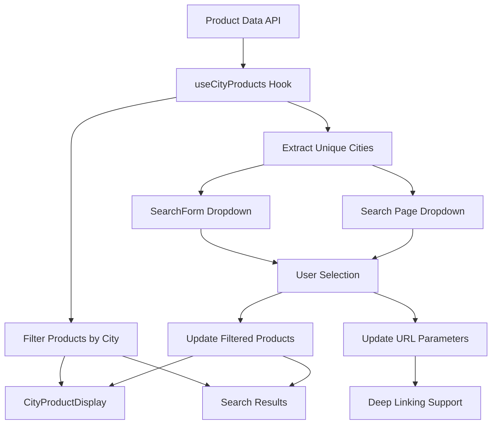

# City-Based Product Filtering System

## Overview

This system provides intelligent city-based filtering for tour products, automatically extracting unique city names from product location data and enabling seamless filtering and display of products by destination. The system is now fully integrated with the main search page at `/search` and provides comprehensive testing capabilities.

## Features

### 🏙️ Dynamic City Extraction
- Automatically extracts unique city names from product `locationAddress` fields
- Handles both string and object-based location formats
- Intelligent parsing of location strings to identify city names
- Real-time updates when product data changes

### 🔍 Smart Filtering
- Filter products by selected city
- Support for "All Destinations" view
- Efficient client-side filtering with server-side API support
- Seamless integration with existing search functionality

### 📊 Enhanced User Experience
- Dynamic dropdown populated with actual city data
- Real-time product count updates
- Loading states and error handling
- Responsive design with grid/list view options

### 🔧 Search Page Integration
- Enhanced `/search` page with city filtering dropdown
- URL parameter support for deep linking
- Filter combination and clearing
- Pagination with city filters maintained

## Architecture

### Core Components

#### 1. Utility Functions (`lib/utils/product-utils.ts`)

```typescript
// Extract city name from locationAddress
getCityFromLocation(locationAddress: string | RezdyAddress): string | null

// Get unique cities from product array
getUniqueCitiesFromProducts(products: RezdyProduct[]): string[]

// Filter products by city
filterProductsByCity(products: RezdyProduct[], selectedCity: string): RezdyProduct[]
```

#### 2. Custom Hook (`hooks/use-city-products.ts`)

```typescript
interface CityProductsState {
  products: RezdyProduct[];
  cities: string[];
  selectedCity: string;
  filteredProducts: RezdyProduct[];
  loading: boolean;
  error: string | null;
}

interface CityProductsActions {
  setSelectedCity: (city: string) => void;
  refreshData: () => void;
}
```

#### 3. Enhanced Search Hook (`hooks/use-search.ts`)
- Added `city` and `location` filter parameters
- Enhanced URL parameter handling
- Improved filter state management
- Support for city-based deep linking

#### 4. Enhanced Search Form (`components/search-form.tsx`)
- Dynamic city dropdown with real-time data
- Integration with existing search functionality
- Support for callback functions to notify parent components
- Loading states and error handling

#### 5. Product Display Component (`components/city-product-display.tsx`)
- Responsive grid/list view options
- Grouped display by city when "All" is selected
- Loading skeletons and error states
- Product selection callbacks

#### 6. Enhanced Search Page (`app/search/page.tsx`)
- Integrated city filtering dropdown
- URL parameter support for city filters
- Active filter badges with city information
- Seamless integration with existing search functionality

#### 7. Demo Page (`app/city-search/page.tsx`)
- Complete implementation showcase
- City statistics and analytics
- Real-time filtering demonstration
- Comprehensive UI with sidebar information

#### 8. Test Suite (`app/test-location/page.tsx`)
- Comprehensive testing interface
- Real data validation
- API integration testing
- Unit test execution

## Data Flow



## Implementation Guide

### 1. Basic Setup

```typescript
import { useCityProducts } from '@/hooks/use-city-products';
import { SearchForm } from '@/components/search-form';
import { CityProductDisplay } from '@/components/city-product-display';

function MyComponent() {
  const { 
    cities, 
    selectedCity, 
    filteredProducts, 
    loading, 
    error 
  } = useCityProducts();

  return (
    <div>
      <SearchForm onCityChange={(city, products) => {
        console.log(`Selected ${city}: ${products.length} products`);
      }} />
      
      <CityProductDisplay
        products={filteredProducts}
        selectedCity={selectedCity}
        loading={loading}
        error={error}
      />
    </div>
  );
}
```

### 2. Search Page Integration

The enhanced search page at `/search` now includes:

```typescript
// URL parameters supported:
// /search?city=Sydney
// /search?city=Melbourne&category=adventure
// /search?location=Brisbane&priceRange=under-500

// Component usage:
const { cities, loading: citiesLoading } = useCityProducts()
const { filters, updateFilter, clearFilter } = useSearch(initialFilters)

// City filter dropdown:
<Select 
  value={filters.city || filters.location || 'all'} 
  onValueChange={(value) => {
    if (value === 'all') {
      clearFilter('city')
      clearFilter('location')
    } else {
      updateFilter('city', value)
    }
  }}
  disabled={citiesLoading}
>
```

### 3. API Integration

The search API now supports city filtering:

```typescript
// GET /api/search?city=Sydney&category=adventure&travelers=2
// GET /api/search?location=Melbourne&priceRange=500-1000
```

Parameters:
- `city`: Filter by specific city name
- `location`: Alternative parameter for city filtering
- All existing search parameters are still supported

### 4. Testing Integration

Access the test suite at `/test-location` to:
- Run unit tests on location extraction logic
- Validate real product data
- Test API integration
- Verify search page functionality

## Location Address Formats

The system handles multiple location address formats:

### String Format
```typescript
locationAddress: "123 Main St, Sydney, NSW 2000, Australia"
```

### Object Format
```typescript
locationAddress: {
  addressLine: "123 Main St",
  city: "Sydney",
  state: "NSW",
  postCode: "2000",
  countryCode: "AU",
  latitude: -33.8688,
  longitude: 151.2093
}
```

## City Extraction Logic

The `getCityFromLocation` function uses intelligent parsing:

1. **Object Format**: Directly extracts the `city` field
2. **String Format**: 
   - Splits by commas
   - Assumes second-to-last part is the city for multi-part addresses
   - Falls back to first part for single-part addresses

## Testing and Validation

### Automated Testing

Visit `/test-location` to access the comprehensive test suite:

1. **Unit Tests**: Test city extraction and filtering logic
2. **Real Data Validation**: Analyze actual product data quality
3. **API Integration**: Test search API with city parameters
4. **Search Page Testing**: Verify enhanced search functionality

### Manual Testing Checklist

- [ ] City dropdown populates with real data
- [ ] Selecting a city filters products correctly
- [ ] URL parameters update when city is selected
- [ ] Deep linking works with city parameters
- [ ] Filter badges display city information
- [ ] Clearing filters removes city selection
- [ ] Pagination maintains city filters
- [ ] Loading states work properly
- [ ] Error handling displays appropriately

### Test URLs

```
/search?city=Sydney
/search?city=Melbourne&category=adventure
/search?location=Brisbane&priceRange=under-500
/city-search
/test-location
```

## Error Handling

### Loading States
- Skeleton loaders during data fetch
- Disabled dropdowns with loading indicators
- Graceful degradation when API is unavailable

### Error States
- Clear error messages for API failures
- Retry functionality with refresh buttons
- Fallback to cached data when possible

### Data Validation
- Filters out empty or invalid city names
- Handles missing location data gracefully
- Validates product data structure

## Performance Optimizations

### Client-Side Caching
- Memoized city extraction and filtering
- Efficient re-renders with React.useMemo
- Optimized product filtering algorithms

### API Efficiency
- Batch product fetching (up to 1000 products)
- Client-side filtering to reduce API calls
- Caching headers for improved performance

### Memory Management
- Efficient data structures for city storage
- Cleanup of unused product references
- Optimized component re-rendering

## Browser Compatibility

- Chrome 60+
- Firefox 55+
- Safari 12+
- Edge 79+
- Mobile browsers (iOS Safari, Chrome Mobile)

## Future Enhancements

### Planned Features
- [ ] Geolocation-based city suggestions
- [ ] City popularity rankings
- [ ] Advanced location search with autocomplete
- [ ] Map integration for city selection
- [ ] Multi-city filtering support
- [ ] Location-based sorting options

### Performance Improvements
- [ ] Virtual scrolling for large city lists
- [ ] Progressive loading of product data
- [ ] Service worker caching
- [ ] GraphQL integration for optimized queries

## Troubleshooting

### Common Issues

**Cities not appearing in dropdown:**
- Check if products have valid locationAddress data
- Verify API connectivity
- Check browser console for errors
- Visit `/test-location` to validate data

**Filtering not working:**
- Ensure city names match exactly (case-insensitive)
- Check for special characters in city names
- Verify product data structure
- Test API endpoints directly

**Search page issues:**
- Check URL parameters are being parsed correctly
- Verify filter state management
- Test with different city combinations
- Check network requests in browser dev tools

**Performance issues:**
- Reduce product fetch limit if needed
- Check for memory leaks in component lifecycle
- Optimize filtering algorithms for large datasets
- Monitor API response times

### Debug Mode

Enable debug logging:
```typescript
const { filteredProducts } = useCityProducts();
console.log('Filtered products:', filteredProducts);

// Test location extraction:
import { runAllLocationTests } from '@/lib/utils/location-test-utils';
runAllLocationTests();
```

### Validation Tools

Use the test suite at `/test-location` to:
- Validate location data quality
- Test extraction algorithms
- Verify API integration
- Check search functionality

## Contributing

When contributing to the city filtering system:

1. Follow existing code patterns and naming conventions
2. Add comprehensive tests for new functionality
3. Update documentation for any API changes
4. Consider performance implications of changes
5. Test with various location address formats
6. Run the test suite to ensure compatibility
7. Test search page integration thoroughly

## License

This city-based product filtering system is part of the Pineapple Tours project and follows the same licensing terms. 