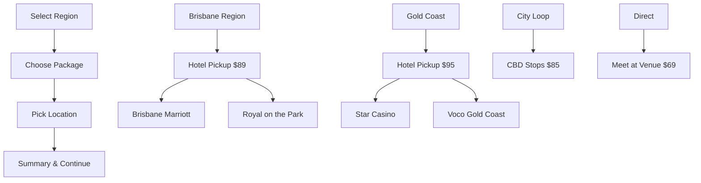

# Booking Option Selector Component

## Overview

The `BookingOptionSelector` component provides a redesigned 'Select Booking Option' section with cascading dropdown menus that streamline the booking selection process. This component guides users through region selection, package options, and specific pickup locations with an intuitive, responsive design.

## Features

### User Experience

- ✅ **Cascading Dropdown Navigation**: Progressive disclosure with 3-step selection flow
- ✅ **Visual Feedback**: Icons, color coding, and animations provide clear state indicators
- ✅ **Real-time Updates**: Pricing calculations and availability checking
- ✅ **Error Handling**: Comprehensive validation with user-friendly error messages
- ✅ **Mobile Responsive**: Optimized for all screen sizes with touch-friendly interactions
- ✅ **Accessibility Compliant**: ARIA labels, keyboard navigation, and screen reader support

### Technical Features

- ✅ **TypeScript**: Strict type checking with comprehensive interfaces
- ✅ **Performance Optimized**: Memoized computations and efficient state management
- ✅ **Click Outside**: Auto-closes dropdowns when clicking outside the component
- ✅ **Smooth Animations**: Framer Motion animations for enhanced user experience
- ✅ **Branded Styling**: Matches website color palette and typography

## Props Interface

```typescript
interface BookingOptionSelectorProps {
  bookingOptions: RezdyBookingOption[]; // Available booking options
  selectedBookingOption?: RezdyBookingOption; // Currently selected option
  selectedPickupLocation?: RezdyPickupLocation; // Currently selected location
  onBookingOptionSelect: (
    option: RezdyBookingOption,
    location: RezdyPickupLocation
  ) => void;
  onContinue?: () => void; // Optional continue callback
  className?: string; // Additional CSS classes
  required?: boolean; // Whether selection is required
  showPricing?: boolean; // Show/hide pricing information
  participantCount?: number; // Number of participants for pricing
}
```

## Usage Examples

### Basic Implementation

```jsx
import { BookingOptionSelector } from "@/components/ui/booking-option-selector";

function BookingPage() {
  const [selectedOption, setSelectedOption] = useState(null);
  const [selectedLocation, setSelectedLocation] = useState(null);

  const handleSelection = (option, location) => {
    setSelectedOption(option);
    setSelectedLocation(location);
  };

  return (
    <BookingOptionSelector
      bookingOptions={bookingOptions}
      selectedBookingOption={selectedOption}
      selectedPickupLocation={selectedLocation}
      onBookingOptionSelect={handleSelection}
      participantCount={2}
      showPricing={true}
      required={true}
    />
  );
}
```

### With Continue Button

```jsx
<BookingOptionSelector
  bookingOptions={bookingOptions}
  selectedBookingOption={selectedOption}
  selectedPickupLocation={selectedLocation}
  onBookingOptionSelect={handleSelection}
  onContinue={() => proceedToNextStep()}
  participantCount={participantCount}
  showPricing={true}
  required={true}
  className="w-full max-w-2xl mx-auto"
/>
```

## Component Architecture

### 1. Region Selection

- Groups booking options by pickup type/region
- Color-coded icons for different regions:
  - Brisbane Region: Blue
  - Gold Coast Region: Orange
  - Brisbane City Loop: Purple
  - Meet at Destination: Green

### 2. Package Selection

- Shows options within selected region
- Displays pricing, availability, and descriptions
- Highlights popular/preferred options with badges
- Shows seat availability and pickup point count

### 3. Location Selection

- Lists specific pickup locations for selected package
- Shows pickup times when available
- Displays addresses and location details
- Auto-closes dropdown on selection

### 4. Selection Summary

- Appears when all selections are complete
- Shows package name, pickup location, and times
- Calculates total pricing for participant count
- Provides clear call-to-action

## Selection Flow



## Styling & Theming

### Color Palette

- **Primary**: Coral (#FF6B6B) for actions and highlights
- **Success**: Green (#10B981) for completed states
- **Warning**: Amber (#F59E0B) for important information
- **Gray Scale**: Various grays for text and borders

### Responsive Breakpoints

- **Mobile**: < 640px - Stacked layout, full-width buttons
- **Tablet**: 640px - 1024px - Responsive grid adjustments
- **Desktop**: > 1024px - Full horizontal layout

### Animation States

- **Dropdown Open**: Slide-in from top with 200ms duration
- **Selection Complete**: Scale animation with success indicators
- **State Changes**: Smooth 150ms transitions
- **Loading States**: Subtle scale animations

## Integration Guide

### 1. Import the Component

```typescript
import { BookingOptionSelector } from "@/components/ui/booking-option-selector";
import { RezdyBookingOption, RezdyPickupLocation } from "@/lib/types/rezdy";
```

### 2. Prepare Data Structure

Ensure your booking options follow the `RezdyBookingOption` interface:

```typescript
interface RezdyBookingOption {
  id: string;
  name: string;
  description: string;
  price: number;
  pickupType: string;
  availability: number;
  isPreferred: boolean;
  pickupLocations: RezdyPickupLocation[];
}
```

### 3. Handle State Management

```typescript
const [selectedBookingOption, setSelectedBookingOption] =
  useState<RezdyBookingOption | null>(null);
const [selectedPickupLocation, setSelectedPickupLocation] =
  useState<RezdyPickupLocation | null>(null);

const handleBookingOptionSelect = (
  option: RezdyBookingOption,
  location: RezdyPickupLocation
) => {
  setSelectedBookingOption(option);
  setSelectedPickupLocation(location);
  // Additional logic for pricing updates, validation, etc.
};
```

### 4. Integrate with Existing Booking Flow

Replace existing pickup selection components with the new `BookingOptionSelector` in your booking experience:

```typescript
// In enhanced-booking-experience.tsx
{hasFitTourOptions ? (
  <BookingOptionSelector
    bookingOptions={fitTourBookingOptions}
    selectedBookingOption={selectedBookingOption}
    selectedPickupLocation={selectedPickupLocation}
    onBookingOptionSelect={handleBookingOptionSelect}
    participantCount={totalParticipants}
    showPricing={true}
    required={true}
  />
) : (
  // Fallback to standard pickup selector
)}
```

## Error Handling

The component includes comprehensive error handling:

### Validation Errors

- **Region Selection**: "Please select a pickup region"
- **Package Selection**: "Please select a booking option"
- **Location Selection**: "Please select a specific pickup location"
- **Availability**: "Only X seats available for this option"

### User Feedback

- Real-time validation with immediate error display
- Clear error messages with actionable guidance
- Visual indicators for invalid selections
- Prevents progression with incomplete data

## Testing & QA

### Manual Testing Checklist

- [ ] All dropdown states work correctly
- [ ] Pricing updates in real-time
- [ ] Error messages display appropriately
- [ ] Mobile responsiveness verified
- [ ] Accessibility features tested
- [ ] Cross-browser compatibility confirmed

### Demo Page

Visit `/demo/booking-option-selector` to interact with the component and test all features in a controlled environment.

## Browser Support

- ✅ Chrome 90+
- ✅ Firefox 88+
- ✅ Safari 14+
- ✅ Edge 90+
- ✅ Mobile Safari (iOS 14+)
- ✅ Chrome Mobile (Android 9+)

## Performance Considerations

- Uses `useMemo` for expensive computations
- Implements `useEffect` for side effect management
- Optimized re-rendering with proper dependency arrays
- Efficient event handling with cleanup
- Minimal DOM manipulations through React state

## Future Enhancements

- [ ] Keyboard-only navigation improvements
- [ ] Voice control integration
- [ ] Multi-language support
- [ ] A/B testing framework integration
- [ ] Advanced filtering and search
- [ ] Saved preferences and bookmarking
